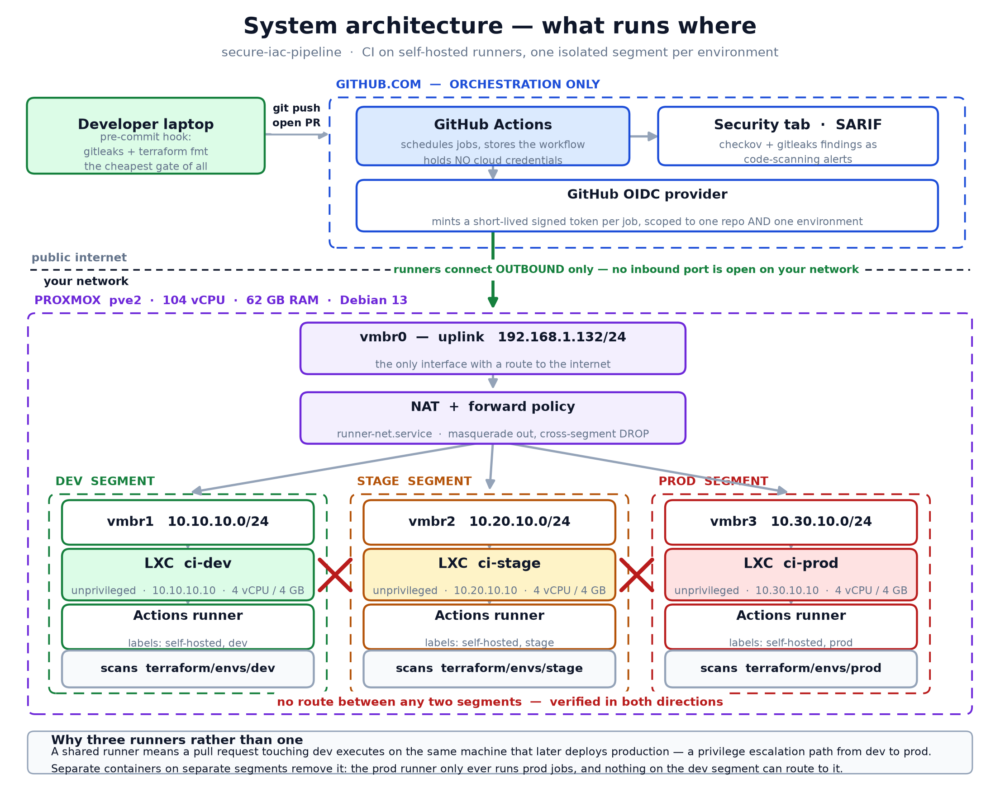

# How it is built

The technical design, in three parts:

1. **The GitHub Actions pipeline** - how it is configured for dev, stage and prod, and what runs where.
2. **The code** - what the Terraform builds, and what every other piece of code in the repository does.
3. **The system design** - how a merge on GitHub becomes a Linux container on the Proxmox host, per environment, and why it is laid out this way.

Everything in this document is read from the code as it is committed. Where the diagram and the code disagree, the code is right and the disagreement is noted.

---

# Part 1  -  The GitHub Actions pipeline

One workflow file: `.github/workflows/security-pipeline.yml`. Three jobs. Three self-hosted runners.

## When it runs

| Trigger | What runs | Why |
|---|---|---|
| Pull request against `main` | Secrets, IaC (dev, stage, prod) | Every proposed change is scanned before anyone reviews it |
| Push to `main` (a merge) | Secrets, IaC x3, then Deploy dev, stage, prod in order | A merge is the only path to a deploy |
| Manual (`workflow_dispatch`) | Secrets, IaC x3, then Deploy for **one** chosen environment | Lets a single environment be re-applied cleanly, which is what a live demo needs |

Two settings at the top of the file matter:

- `permissions: contents: read` - the workflow token can read code and nothing else by default. Each job adds only what it needs (`security-events: write` to upload scan results, `pull-requests: write` to comment).
- `concurrency: cancel-in-progress: true` - a second push to the same branch cancels the run already going. Two applies from the same branch cannot race each other.

## The three runners

GitHub does not run any of this. GitHub schedules the jobs; the work happens on three Linux containers on the Proxmox host that connect **outbound** to GitHub and pull their jobs down. Nothing on the internet connects in.

| Runner | Container | Label | Network | Holds |
|---|---|---|---|---|
| ci-dev | 201 | `dev` | 10.10.10.10 on vmbr1 | dev age key, dev database credentials |
| ci-stage | 202 | `stage` | 10.20.10.10 on vmbr2 | stage age key, stage database credentials |
| ci-prod | 203 | `prod` | 10.30.10.10 on vmbr3 | prod age key, prod database credentials |

Every job says which runner it wants with a label:

```yaml
runs-on: [self-hosted, "${{ matrix.environment }}"]
```

So the prod IaC job can only ever land on ci-prod, and ci-prod never receives a dev job. That one line is the isolation boundary. A pull request that touches dev never executes on the machine that can deploy production.

Each runner has Terraform 1.5.7 and gitleaks 8.30.1 installed into the container image, not downloaded per job. A build cannot silently pick up a newer toolchain than the one that was reviewed.

## Job 1  -  Secrets

Runs on **ci-dev**, the lowest-trust runner, because secret scanning only reads source code and needs no keys to do it.

```
checkout (fetch-depth: 0)   -> the whole history, not just the tip
gitleaks version             -> prove the pinned binary is there
gitleaks detect --source .   -> scan every commit ever made
upload SARIF                 -> findings appear in the Security tab
```

`fetch-depth: 0` is the line that makes the scanner real. The default checkout fetches one commit. A password committed last week and deleted yesterday is invisible to a one-commit scan and fully visible to a full-history scan. That deleted-but-still-there case is the one that actually matters, and it is STEP 3 of the demo.

The pipeline runs the `gitleaks` binary directly, not the `gitleaks-action` wrapper. On a repository's first push the action scans a commit range with no starting point, scans zero bytes, and prints "no leaks found". A scanner that passes while scanning nothing is worse than no scanner. This was found by testing it, and is written up in doc 3.

If this job fails, nothing else runs.

## Job 2  -  IaC (dev, stage, prod)

A matrix job. The same steps run three times, each on its own runner, each against its own Terraform directory. `fail-fast: false` so a failure in one environment does not hide the results for the other two.

```
checkout
python venv + checkov            -> Debian 13 refuses pip into system Python (PEP 668)
terraform fmt -check             -> formatting is a gate, not a suggestion
SOPS decrypt secrets.enc.yaml    -> with the age key that exists only on THIS runner
terraform init (pg backend)      -> connects to this environment's state database
terraform validate
checkov  -> JSON + SARIF         -> the actual scan
upload SARIF                     -> Security tab, category checkov-<env>
ai_triage.py --fail-on-blocking  -> sorts, explains, and decides
comment on the PR                -> the triage report, one per environment
enforce the gate                 -> exit 1 if triage found a blocking policy
```

Three things about this job that are deliberate:

**Checkov itself does not fail the build.** It runs with `--soft-fail` and the step is `continue-on-error`. The decision is made by `scripts/ai_triage.py`, which reads Checkov's JSON and checks it against a short, version-controlled list of blocking policy IDs. Checkov reports 24 findings against 110 lines of Terraform; without a triage step the signal is lost inside a week.

**The SOPS decrypt uses a key that is only on this runner.** The encrypted file is committed to the repository in the open. The dev runner holds only the dev private key, so it cannot decrypt the stage or prod file even though it has a copy of both. This is the network isolation extended to cryptography.

**The comment is written on every run, pass or fail.** A reviewer sees what the scanner thought before they read the diff.

## Job 3  -  Deploy (dev, stage, prod)

Only runs on a push to `main` or a manual dispatch. Needs both scan jobs to have passed. `max-parallel: 1`, so it is always dev, then stage, then prod.

```
checkout
SOPS decrypt                     -> database credentials AND the Proxmox API token
terraform init (pg backend)      -> schema deploy_<env>
terraform plan -out=tfplan       -> what will change
terraform show -json tfplan      -> the plan, as data
policy_check.py --plan plan.json -> the Proxmox policy gate, against the PLAN
terraform apply tfplan           -> the exact plan that was checked, nothing else
terraform output                 -> container IDs and hostnames
```

Each matrix entry declares `environment: ${{ matrix.environment }}`. That binds the job to a **GitHub Environment**, which is where the approval gate lives:

| Environment | Required reviewer | Result |
|---|---|---|
| dev | none | applies automatically the moment scans pass |
| stage | one | the job pauses; GitHub sends a review request; someone clicks Approve |
| prod | one | same, and it cannot start until stage has finished |

Promotion is a decision a person makes, not a side effect of a merge.

**Why plan, then check, then apply the saved plan.** Checkov has no rules for the Proxmox provider. Scanned with Checkov alone, the deploy code passes every check by being unrecognised. So the policy for it is written in `scripts/policy_check.py` and runs against the JSON of the plan - variables resolved, modules expanded, exactly what will be created. Then `apply` is given the same saved plan file, so what was checked is what is built.

## The GitHub-side configuration

Set in the repository settings, not in the workflow file:

| Setting | Value | What it enforces |
|---|---|---|
| Branch protection on `main` | 4 required checks: Secrets, IaC (dev), IaC (stage), IaC (prod) | Nothing merges with a failed scan |
| | 1 approving review | Nobody merges their own change |
| | Branch must be up to date | The checks ran against the code that will actually merge |
| Environments | `dev`, `stage`, `prod`; reviewers on stage and prod | The approval pause in the deploy job |
| Repository secrets | `ANTHROPIC_API_KEY` only, optional | The triage script explains findings in plain English when it has the key, and produces the same report from local rules when it does not. There is no cloud credential and no deploy credential in GitHub |
| Runners | three, self-hosted, labels dev / stage / prod | Job routing |

The absence is the point of the last two rows. GitHub holds nothing that could create or destroy infrastructure. If the GitHub account were compromised, an attacker could schedule jobs, but every credential that matters is on a runner behind NAT on a network they cannot reach.

## What each environment sees, side by side

| | dev | stage | prod |
|---|---|---|---|
| Scanned on | ci-dev | ci-stage | ci-prod |
| Deployed by | ci-dev | ci-stage | ci-prod |
| Deploy trigger | automatic on merge | approval | approval, after stage |
| Terraform state schema | `deploy_dev` | `deploy_stage` | `deploy_prod` |
| State database, role | `tfstate_dev`, `tf_dev` | `tfstate_stage`, `tf_stage` | `tfstate_prod`, `tf_prod` |
| Decryption key | dev age key | stage age key | prod age key |
| Proxmox API token | `terraform@pve!ci-dev` | `terraform@pve!ci-stage` | `terraform@pve!ci-prod` |
| Policy PVE-1 unprivileged | enforced | enforced | enforced |
| Policy PVE-3 start on boot | advisory | enforced | enforced |
| Policy PVE-4 delete protection | advisory | advisory | enforced |

The pipeline code is identical for all three. The rows differ because of which runner picks the job up and what that runner holds.

---

# Part 2  -  The code

## The repository

```
secure-iac-pipeline/
  .github/workflows/security-pipeline.yml   the pipeline (Part 1)
  terraform/
    modules/claims-platform/                 the AWS claims platform, one definition
    envs/{dev,stage,prod}/                   AWS platform per environment  - SCANNED
    modules/workload/                        the Proxmox application tier, one definition
    deploy/{dev,stage,prod}/                 application tier per environment - APPLIED
    bootstrap/github-oidc.tf                 the AWS trust, applied once by an admin
    insecure/main.tf                         deliberately broken, so the gate has something to catch
  scripts/
    ai_triage.py                             sorts Checkov findings, holds the blocking list
    policy_check.py                          the Proxmox policy gate, run against the plan
    install_app.sh                           puts the application on the containers
    validate.sh                              38 checks, run from the host the morning of
    demo_secret_persistence.sh               STEP 3: a deleted password is still in git
  .gitleaks.toml                             what counts as a secret
  .sops.yaml                                 which age key encrypts which file
  .pre-commit-config.yaml                    gitleaks + terraform fmt before a commit exists
  Makefile                                   the CI gates, runnable locally
  docs/final/                                these documents
```

## Terraform: two trees, and why

There are two separate sets of Terraform, and being clear about which does what is the difference between an honest answer and a vague one.

### Tree 1  -  `terraform/envs/` + `modules/claims-platform`: the AWS platform

**What it describes:** the infrastructure a claims platform needs on AWS. One module, instantiated three times:

- A KMS customer-managed key with rotation on and an explicit key policy
- A claims-documents S3 bucket: public access blocked, versioned, encrypted with the CMK, access-logged, lifecycle rules for old versions and abandoned uploads
- An access-logs bucket with the same protections
- An application-tier security group: HTTPS in from the corporate range only, egress scoped, no SSH at all
- A PostgreSQL RDS instance: encrypted with the CMK, not publicly accessible, enhanced monitoring, logs to CloudWatch, Secrets Manager for the master password, IAM authentication, auto minor upgrades, Performance Insights, 30-day backups, final snapshot

Every attribute is annotated with the Checkov policy ID it satisfies. The environments differ only in what the root passes in:

| | dev | stage | prod |
|---|---|---|---|
| Multi-AZ | no | yes | yes |
| Deletion protection | no | yes | yes |
| Backup retention | 7 days | 14 days | 30 days |
| Instance class | db.t3.medium | db.t3.large | db.r6g.xlarge |
| Trusted CIDR | 10.10.0.0/16 | 10.20.0.0/16 | 10.30.0.0/16 |
| State schema | terraform_dev | terraform_stage | terraform_prod |

A control that is on in prod cannot be quietly absent in dev, because there is only one definition. Dev is cheaper by three explicit variables, and `ai_triage.py` knows which policies those three variables affect (`PROMOTION_GATED_POLICIES`) so it reports them in dev as expected rather than as failures.

**What the pipeline does with it:** `fmt`, `init` against the state database, `validate`, Checkov, triage. It does not `apply`. There is no AWS account behind this demo, and the workflow does not pretend there is. This tree exists because it is what Checkov has rules for, and because it is the corrected twin of `terraform/insecure/`.

**`terraform/bootstrap/github-oidc.tf`** is the piece that would make the AWS apply possible without storing a credential: an IAM OIDC provider for GitHub and a role whose trust policy is scoped to one repository *and* one GitHub Environment (`repo:org/repo:environment:prod`). It is applied once by an administrator, not by the pipeline. It is in the repository so the design is complete and reviewable. It is not applied.

### Tree 2  -  `terraform/deploy/` + `modules/workload`: the application tier on Proxmox

**What it describes:** the Linux containers the web application runs on. One module, instantiated three times. Each container is:

- An unprivileged LXC from a Debian 13 template
- On its environment's own bridge, with a fixed address, gateway, and resolvers
- Sized per environment
- Started, with the admin SSH keys installed from the first boot
- With `start_on_boot` and `protection` set per environment

| | dev | stage | prod |
|---|---|---|---|
| Containers | 1 (VMID 301) | 1 (VMID 311) | 2 (VMID 321, 322) |
| Hostnames | app-dev-1 | app-stage-1 | app-prod-1, app-prod-2 |
| Address | 10.10.10.20 | 10.20.10.20 | 10.30.10.20, .21 |
| Bridge | vmbr1 | vmbr2 | vmbr3 |
| CPU / memory / disk | 2 / 2 GB / 8 GB | 2 / 2 GB / 12 GB | 2 / 2 GB / 20 GB |
| Restart on boot | no | yes | yes |
| Delete protection | no | no | yes |
| State schema | deploy_dev | deploy_stage | deploy_prod |

**What the pipeline does with it:** plan, policy check, apply. This is the tree that builds real machines. The demo change is one line in `terraform/deploy/prod/main.tf`: `replica_count = 2` becomes `3`, and the pipeline creates VMID 323 as app-prod-3 at 10.30.10.22.

Two decisions inside the module are worth being able to explain:

*The host octet is a fixed offset, not derived from the VMID.* The first version derived it, and `301 % 100 = 1` put app-dev-1 on the gateway address. The segment layout is now explicit: `.1` gateway, `.10` runner, `.20` onward workloads.

*The per-container firewall flag is off.* Enabling it inserts an extra bridge in front of the container's NIC and drops return traffic for outbound connections, which breaks DNS and apt. Isolation between environments never depended on this flag - it is enforced by the host's forward policy and verified in both directions (doc 6, group 6). The reason is written in the module and in policy `PVE-2` rather than the policy being quietly deleted.

### `terraform/insecure/main.tf`

The same claims platform with every control removed: public bucket, unencrypted database reachable from the internet, SSH open to the world. It exists so the gate has something real to block. `make scan-insecure` runs the triage against it and the correct result is a non-zero exit.

## Everything that is not Terraform

| File | Language | What it does | Where it runs |
|---|---|---|---|
| `scripts/ai_triage.py` | Python | Reads Checkov's JSON. Holds `BLOCKING_POLICIES`, `PROMOTION_GATED_POLICIES`, `ADVISORY_POLICIES`. Decides pass or fail from those lists alone. With an API key, asks Claude to explain and order the findings for the PR comment; without one, produces the same report from local rules. The model never decides pass/fail | IaC job, each runner |
| `scripts/policy_check.py` | Python | Reads `terraform show -json` of the plan. Checks every planned container against PVE-1 to PVE-4, tiered by environment. Exits 1 on a blocking failure | Deploy job, each runner |
| `scripts/install_app.sh` | Bash | For every running `app-<env>-N` container: creates the `rapta` service account, installs Python and curl if missing, pushes the release into `/opt/rapta/inspection/releases/<version>/`, builds a venv, flips the `current` symlink, installs and starts the systemd unit, waits for `/health`. Skips any container already serving the right version | The Proxmox host, as `/root/install-app.sh <env>` |
| `scripts/validate.sh` | Bash | 38 checks in 9 groups. Doc 6 explains each one | The Proxmox host |
| `scripts/demo_secret_persistence.sh` | Bash | Builds a throwaway repo, commits a credential, deletes it, ignores it, encrypts it, and shows it is still retrievable | Anywhere; STEP 3 of the demo |
| `.gitleaks.toml` | TOML | The secret patterns, and the allowlist for the one synthetic key the demo uses | pre-commit, Secrets job |
| `.sops.yaml` | YAML | Three creation rules: one age public key per environment file. `encrypted_regex` means only values named like a password or token are encrypted; usernames, hosts and the token ID stay readable so a diff shows *which* secret changed | Anywhere SOPS runs |
| `terraform/envs/<env>/secrets.enc.yaml` | YAML | The database credentials and Proxmox API token for one environment, encrypted to that environment's key. Committed in the open | Decrypted on the matching runner only |
| `.pre-commit-config.yaml` | YAML | gitleaks, terraform fmt, terraform validate, detect-private-key, and the usual hygiene hooks. A secret caught here never becomes a commit | Developer laptop |
| `Makefile` | Make | `make scan`, `make secrets`, `make validate`, `make all`. The same gates as CI, runnable locally, so "it passed on my machine" means the same thing as "it passed in CI" | Developer laptop |

## Not in the repository, but part of the system

These live on the Proxmox host. They were built by hand and are documented in doc 5.

| Thing | Where | What |
|---|---|---|
| `runner-net.sh` + `runner-net.service` | host, `/usr/local/sbin` | NAT for each segment out through vmbr0; DROP for every cross-segment pair; ESTABLISHED,RELATED accepted. Runs at boot |
| The three runner containers | 201, 202, 203 | GitHub runner agent, pinned Terraform and gitleaks, one age private key each |
| The state database | 204, PostgreSQL | Three databases, three roles. `pg_hba.conf` accepts each role only from its own subnet |
| `/opt/app-source/` | host | `app.py`, `requirements.txt`, `VERSION`, `inspection-service.service` - what `install_app.sh` pushes |
| The application | each app container | A small Python web service on port 8080. `/` returns the greeting plus its own hostname and environment; `/health` returns 503 for the first two seconds then `ok`; `/version` returns the release |

**Why the application install is not a pipeline step.** Terraform talks to the Proxmox API to create containers. It never logs into them. The runner for each environment is on that environment's network, but the deliberate absence of any inbound path means a runner cannot SSH to a workload either. So the install runs from the host, where `pct exec` can reach every container, as a separate stage. This is the honest shape of the current build; the evolution would be a fourth runner on the management segment, or cloud-init on the container template. Doc 4 has the answer for "why not Ansible".

---

# Part 3  -  The system design



*One correction to the diagram: the workload boxes say "firewall on". The per-container firewall flag is off, for the reason given in Part 2. Isolation is enforced at the host forward policy, which the diagram does show.*

## The layers, top to bottom

```
  Developer laptop
     pre-commit: gitleaks + terraform fmt
        |
        |  git push
        v
  GitHub.com                                  orchestration only
     Actions schedules jobs                   holds NO cloud credential,
     Environments hold the approval gate      NO deploy credential
     Security tab shows SARIF                 NO network path to anything
        |
        |  runners poll OUTBOUND over HTTPS; nothing connects in
        v
  Proxmox host  pve2  192.168.1.132
     vmbr0  uplink
     NAT + forward policy  (runner-net.service)
        |
        +-----------------------+-----------------------+
        v                       v                       v
  vmbr1  10.10.10.0/24    vmbr2  10.20.10.0/24    vmbr3  10.30.10.0/24
  DEV                     STAGE                   PROD
   .10  ci-dev (201)       .10  ci-stage (202)     .10  ci-prod (203)
   .20  app-dev-1 (301)    .20  app-stage-1 (311)  .20  app-prod-1 (321)
                                                    .21  app-prod-2 (322)
        |                       |                       |
        +-----------------------+-----------------------+
                                |  each runner: port 5432 only, own database only
                                v
                     vmbr4  10.40.10.0/24  MANAGEMENT
                       .10  tf-state (204)  PostgreSQL
                            tfstate_dev / tfstate_stage / tfstate_prod
```

No route exists between any two environment segments. Verified in all six directions (doc 6, group 6).

## Which machine does what, per environment

| | dev | stage | prod |
|---|---|---|---|
| **Who scans the code** | ci-dev | ci-stage | ci-prod |
| **Who holds the key** | ci-dev holds the dev age key | ci-stage holds the stage key | ci-prod holds the prod key |
| **Who reads state** | ci-dev, from `tfstate_dev`, as `tf_dev`, from 10.10.10.0/24 | ci-stage, from `tfstate_stage`, as `tf_stage`, from 10.20.10.0/24 | ci-prod, from `tfstate_prod`, as `tf_prod`, from 10.30.10.0/24 |
| **Who calls the Proxmox API** | ci-dev, token `terraform@pve!ci-dev` | ci-stage, token `terraform@pve!ci-stage` | ci-prod, token `terraform@pve!ci-prod` |
| **What gets built** | app-dev-1 (301) on vmbr1 | app-stage-1 (311) on vmbr2 | app-prod-1, -2 (321, 322) on vmbr3 |
| **Who decides** | nobody; automatic on merge | one reviewer, on GitHub | one reviewer, after stage |
| **Who installs the app** | the host, `install-app.sh dev` | the host, `install-app.sh stage` | the host, `install-app.sh prod` |
| **Blast radius if the runner is compromised** | dev containers, dev state | stage containers, stage state | prod containers, prod state - but not dev or stage |

## Three isolation boundaries, not one

The panel will ask "what stops dev reaching prod". There are three answers and each is tested.

**1. Network.** Each environment is an isolated bridge with no physical port. The host's forward policy drops every cross-segment packet. `pct exec 201 -- ping 10.30.10.20` fails. Group 6 of validate.sh tests all six ordered pairs.

**2. Cryptography.** Each environment's secrets file is encrypted to that environment's age public key. The private key exists only on that environment's runner. Group 7 copies the prod encrypted file onto the dev runner and tries to decrypt it there: `no master key`. This assumes the attacker already has the file, which is the stronger test.

**3. Database.** `pg_hba.conf` on tf-state accepts `tf_prod` only from 10.30.10.0/24. Group 8 hands the dev runner the correct prod password and it is still refused, because the source address is checked before the password.

A single boundary is a single mistake away from nothing. Three independent ones mean an attacker needs three independent mistakes.

## A change, end to end

What happens when `replica_count` goes from 2 to 3 in `terraform/deploy/prod/main.tf`.

| # | Where | What | Who or what does it |
|---|---|---|---|
| 1 | Laptop | Edit the file, commit | pre-commit runs gitleaks and terraform fmt first |
| 2 | Laptop -> GitHub | Push the branch, open a pull request | the developer |
| 3 | ci-dev | Secrets job: gitleaks over the whole history | automatic |
| 4 | ci-dev, ci-stage, ci-prod | IaC job x3: fmt, decrypt, init, validate, Checkov, triage | automatic, in parallel |
| 5 | GitHub | Three PR comments, one per environment. Four required checks go green | automatic |
| 6 | GitHub | Merge button stays blocked: "review required" | branch protection |
| 7 | GitHub | A reviewer approves | a person |
| 8 | GitHub | Merge to main. The branch must be up to date or the button says "update branch" first | the developer |
| 9 | ci-dev | Secrets and IaC jobs run again against main | automatic |
| 10 | ci-dev | Deploy (dev): plan shows no change, policy passes, apply is a no-op | automatic |
| 11 | GitHub | Deploy (stage) pauses, waiting for review | environment protection |
| 12 | GitHub | Approve stage | a person |
| 13 | ci-stage | Deploy (stage): no change, no-op | automatic |
| 14 | GitHub | Deploy (prod) pauses | environment protection |
| 15 | GitHub | Approve prod | a person |
| 16 | ci-prod | Decrypt prod secrets, init against `tfstate_prod` | automatic |
| 17 | ci-prod | `terraform plan`: 1 to add, `module.workload.proxmox_virtual_environment_container.app[2]` | automatic |
| 18 | ci-prod | `policy_check.py`: PVE-1, PVE-3, PVE-4 all pass on the planned container | automatic |
| 19 | ci-prod -> Proxmox API | `terraform apply`: Proxmox creates VMID 323 from the Debian template, on vmbr3, at 10.30.10.22, unprivileged, boot on, protected | automatic |
| 20 | ci-prod -> tf-state | State written to `deploy_prod` schema; lock released | automatic |
| 21 | Host | `/root/install-app.sh prod`: 321 and 322 are already serving 1.1.0 and are skipped; 323 gets the service account, Python, the release, the venv, the symlink, the unit | the operator |
| 22 | Host | `curl http://10.30.10.22:8080/` returns the greeting with `"host": "app-prod-3"` and `"environment": "prod"` | verification |

Steps 3 to 20 are the pipeline. Step 21 is the deploy step. Step 22 is the proof.

## The decisions, and why

**Self-hosted runners rather than GitHub-hosted.** The infrastructure is on a private network. A GitHub-hosted runner cannot reach the Proxmox API or the state database without exposing them to the internet. Self-hosted runners connect outbound and nothing is exposed.

**Three runners rather than one.** With one runner, a pull request that touches dev executes on the machine that holds the prod key. That is a privilege escalation path from dev to prod, and it is removed by having three.

**Secret scanning on the dev runner.** It needs no credentials, so it gets none. Least privilege applied to the job that reads the most code.

**State in PostgreSQL rather than a file or S3.** The `pg` backend gives real locking through advisory locks. Two applies racing each other corrupt state, and that is not theoretical. One database per environment, one role per database, and the database refuses each role from any subnet but its own.

**SOPS with age rather than GitHub Secrets.** GitHub Secrets are decrypted by GitHub and injected into any job that asks. SOPS files are decrypted by the runner, with a key GitHub never sees. A compromised GitHub account gets encrypted files it cannot open.

**Policy against the plan, not the source.** The plan has variables resolved and modules expanded. A source-level check can be defeated by a default changing in a file it did not look at. The plan is what will actually be created.

**The saved plan is what gets applied.** `terraform apply tfplan`, not `terraform apply`. The thing that was checked is the thing that is built, with no window for the code to change in between.

**Dev applies automatically; stage and prod wait.** Blocking dev on production-grade controls is how a team learns to route around the pipeline. Letting prod apply on merge is how an incident starts. The gate is where the cost of being wrong changes.

**Terraform never logs into a container.** It calls the Proxmox API and stops. The runner has no SSH key to the workloads and no route to them either. The install is a separate step from the host. Narrower than a runner that can do everything; honest about where the boundary is today.

**The per-environment policy tiers.** Dev is allowed to be cheaper: no boot persistence, no delete protection. Stage must survive a reboot. Prod must survive a reboot and a mistaken `terraform destroy`. The policy table says so in one place, and says why.

## Built by hand versus built by the pipeline

| Built by hand, once | Built by the pipeline, every time |
|---|---|
| The four bridges and the forward policy | Every application container |
| The three runners, their tools, their keys | Its address, size, boot and protection settings |
| The state database, its roles, its `pg_hba.conf` | Its SSH keys and resolvers |
| The Proxmox API tokens | The state record of all of the above |
| The GitHub Environments and branch protection | |

The left column is the platform. The right column is what the platform exists to build. The line between them is the line between doc 5 and this document.

---

# What this does not cover

- GitHub-side runtime security (Dependabot, CodeQL on the Python, signed commits) - not enabled.
- Container image or dependency scanning - there is no image and the dependency tree is one file.
- Anything inside the running application beyond the three endpoints.
- Disaster recovery of the host itself. The runners and the state database are hand-built and are not in Terraform.
- Load. Two production replicas is a demonstration of a count, not a capacity plan.

Doc 6 has the fuller list, with the honest answer to each.
